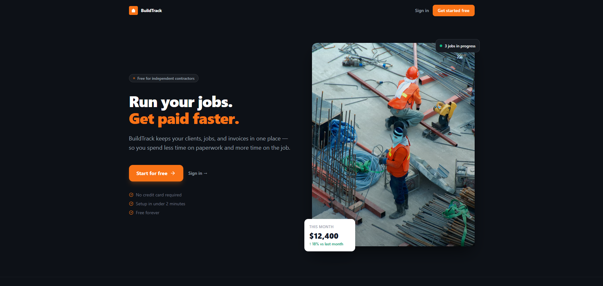
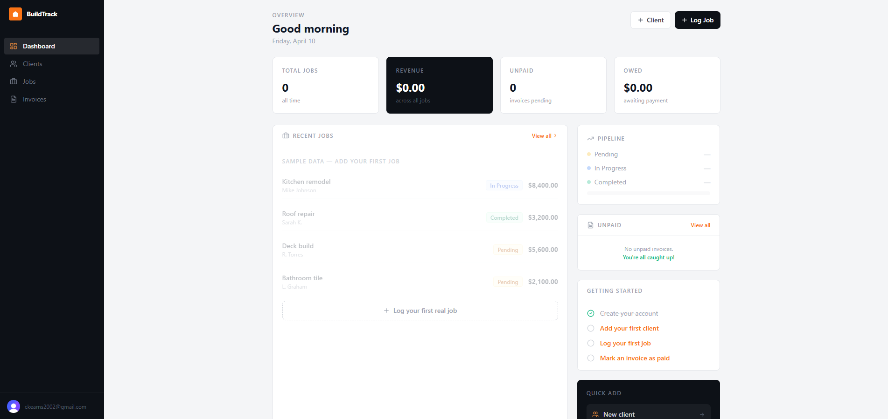

# BuildTrack

> Job management software for independent contractors and small construction crews.

**Live demo:** https://build-track-eight.vercel.app

---

## What it does

Most contractors track their jobs in a notebook, a spreadsheet, or their head. BuildTrack replaces that with a clean dashboard that shows you exactly what's in progress, what's owed, and what's been paid — updated in real time.

- Log jobs and assign them to clients
- Invoices are generated automatically when a job is created
- Track payment status (unpaid, paid, overdue)
- Dashboard shows revenue, pipeline, and outstanding amounts at a glance

---

## Tech stack

| Layer | Tech |
|---|---|
| Frontend | React 18, TypeScript, Vite, Tailwind CSS |
| Backend | Node.js, Express, TypeScript |
| Database | PostgreSQL (Railway) |
| ORM | Prisma |
| Auth | Clerk |
| Deploy | Vercel (client) + Railway (server + DB) |

---

## Architecture

```
BuildTrack/
├── client/                  # React frontend (deployed to Vercel)
│   └── src/
│       ├── pages/           # Dashboard, Jobs, Clients, Invoices, Landing
│       ├── components/      # Layout, Modal, Badge, EmptyState
│       └── lib/api.ts       # Typed fetch wrapper — attaches Clerk JWT automatically
│
└── server/                  # Express backend (deployed to Railway)
    ├── src/
    │   ├── routes/          # REST endpoints for jobs, clients, invoices
    │   ├── middleware/      # Clerk JWT verification
    │   └── index.ts
    └── prisma/
        └── schema.prisma    # DB schema — Client, Job, Invoice
```

The frontend and backend are separate deployments. Every API request goes through `useApi()` which automatically fetches a Clerk JWT and attaches it as a Bearer token. The server verifies the token on every request, so users can only ever see their own data.

---

## Data model

```prisma
Client  → has many Jobs
Job     → belongs to Client, has one Invoice (auto-created)
Invoice → belongs to Job, status: UNPAID | PAID | OVERDUE
```

When a job is created, an invoice is automatically generated with a 30-day due date and the same amount. If the job amount is updated, the invoice amount stays in sync.

---

## Running locally

**Requirements:** Node 18+, a PostgreSQL database, a Clerk account

```bash
# 1. Clone
git clone https://github.com/Chri2K02/BuildTrack.git
cd BuildTrack

# 2. Server setup
cd server
npm install
cp .env.example .env
# Fill in DATABASE_URL and CLERK_SECRET_KEY in .env
npm run db:push
npm run dev

# 3. Client setup (new terminal)
cd client
npm install
cp .env.example .env
# Fill in VITE_CLERK_PUBLISHABLE_KEY in .env
npm run dev
```

Visit `http://localhost:5173`

---

## Deployment

**Backend → Railway**
- Root directory: `server`
- Build command: `npm install && npm run build`
- Start command: `npm run start`
- Environment variables: `DATABASE_URL`, `CLERK_SECRET_KEY`, `CLIENT_URL`

**Frontend → Vercel**
- Root directory: `client`
- Environment variables: `VITE_CLERK_PUBLISHABLE_KEY`, `VITE_API_URL`

---

## Screenshots

### Landing page


### Dashboard


---

## What I'd add next

- [ ] PDF invoice export
- [ ] Email invoice to client directly
- [ ] Job photos / file attachments
- [ ] Mobile app (React Native)
- [ ] QuickBooks integration

---

## License

MIT
